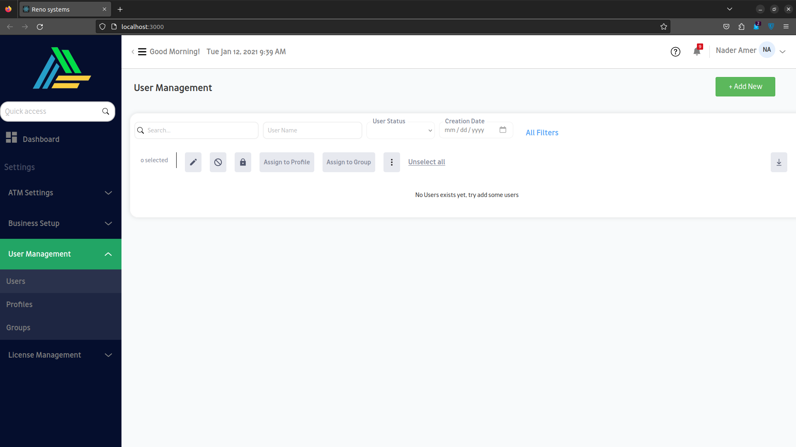
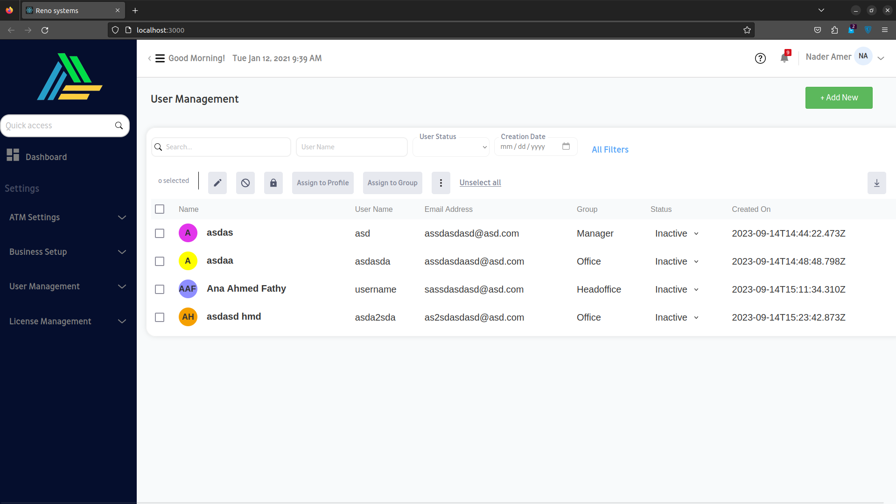
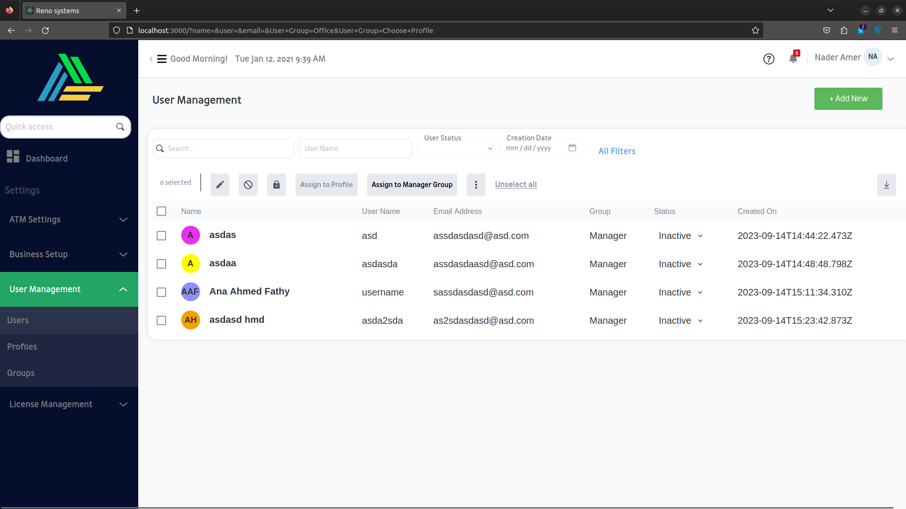
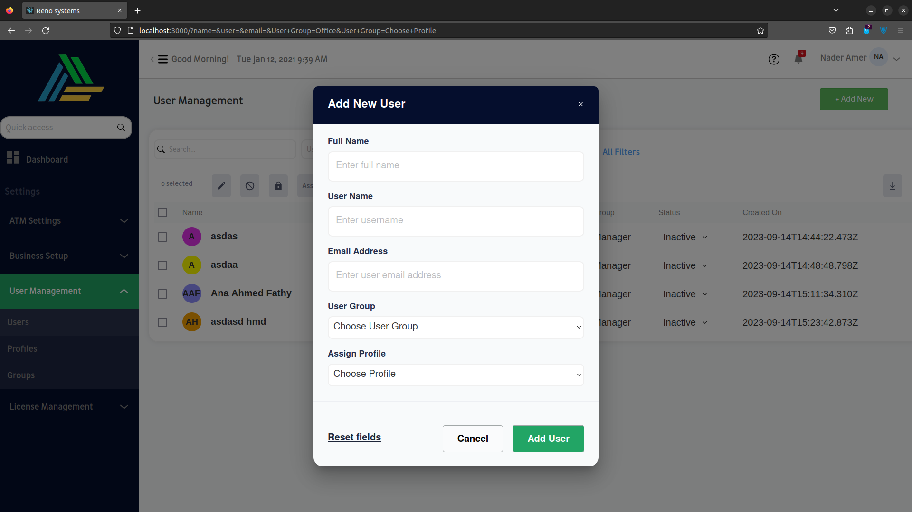
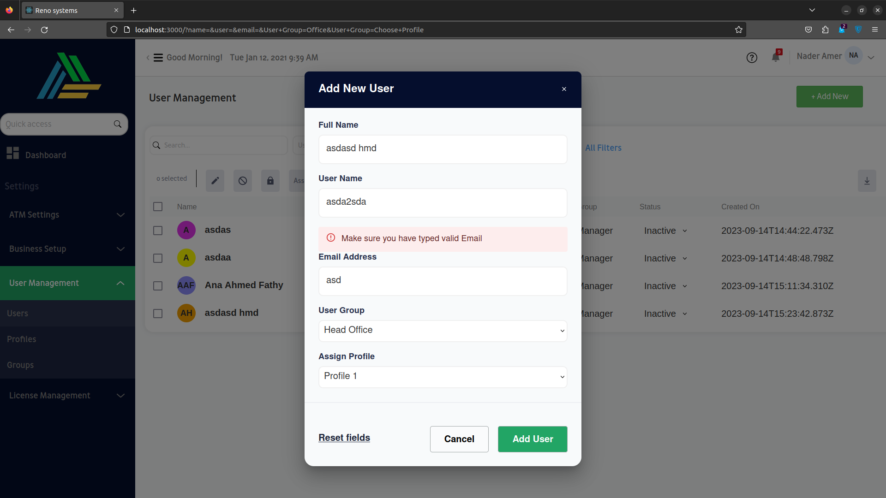
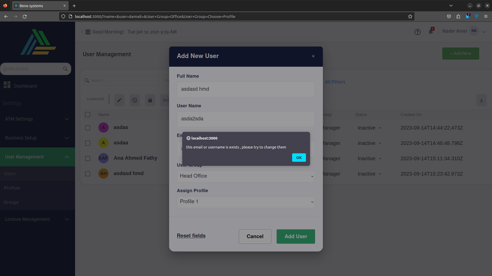
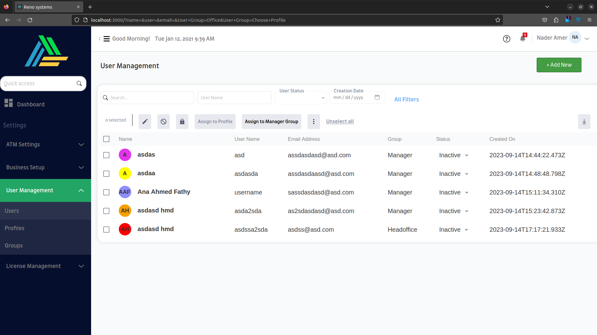

<p align="center">
  <a href="" rel="noopener">
 </a>
</p>

<h3 align="center">renosystems</h3>

<div align="center">

[]()

[](https://github.com/kylelobo/The-Documentation-Compendium/pulls)
[](/LICENSE)

</div>

---

<p align="center"> 
      
      this is an assignment for renosystems.
      it is a dashboard where you can add users , 
      add them to manager group and much more
      it is done using React js, SASS , Node.js, Express, Mongodb
</p>

## 📝 Table of Contents

- [About](#about)
- [Getting Started](#getting_started)
- [Usage](#usage)
- [Built Using](#built_using)
- [Authors](#authors)

## 🧐 About <a name = "about"></a>

      it is sample of one page to show dashboard 
      and add some users and display them

  When you start the application and there is no users yet, you will find that
  <p align="center">
    <a href="" rel="noopener">
    </a>
  </p>

  When you add some users to the database, you will find that
  Note that each user will be assigned different color in his label
  <p align="center">
    <a href="" rel="noopener">
    </a>
  </p>

  you can check them and do any operation you want on one or more than one of them as you want 
  <p align="center">
    <a href="" rel="noopener">
    </a>
  </p>

  When checked them and assign them to manager group, as You can see the checked users changed to be managers all

  <p align="center">
    <a href="" rel="noopener">
    </a>
  </p>

  when you try to add new user
  <p align="center">
    <a href="" rel="noopener">
    </a>
  </p>

  Make sure that you typed email,username,name correctlly so no error will appear

  <p align="center">
    <a href="" rel="noopener">
    </a>
  </p>


  When you try to add user that has the same email as someone else, it will display an error indicating that
  <p align="center">
    <a href="" rel="noopener">
    </a>
  </p>

  conrags, you have add new user :D
  <p align="center">
    <a href="" rel="noopener">
    </a>
  </p>


## 🏁 Getting Started <a name = "getting_started"></a>

you can just clone the repo using 

```
  git clone https://github.com/mhmdahmedfathi/RENOSYSTEMS.git
```

then, you have to enter to the main directory and install the modules using ``` npm install ```

then, you can type ```npm start``` and start the frontend application

for the backend, you have to move to the server folder using ```cd server``` and install its modules using ```npm install```
and then start the program using ```node index.js```

### Prerequisites

What things you need to install

```
node js
react js
```

## 🎈 Usage <a name="usage"></a>

Add notes about how to use the system.

## ⛏️ Built Using <a name = "built_using"></a>

- [MongoDB](https://www.mongodb.com/) - Database
- [Express](https://expressjs.com/) - Server Framework
- [NodeJs](https://nodejs.org/en/) - Server Environment
- [ReactJs](https://react.dev//) - Web Framework

## ✍️ Authors <a name = "authors"></a>

- [@mhmdahmedfathi](https://github.com/mhmdahmedfathi) - Idea & Initial work


